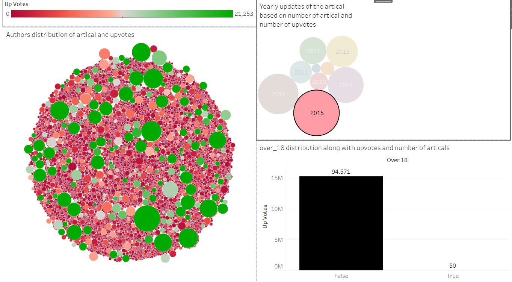
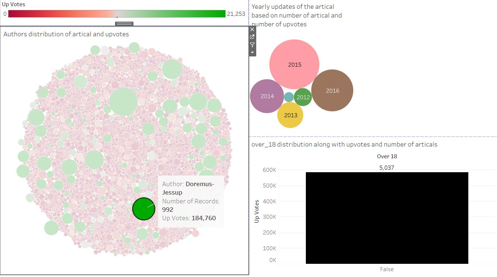
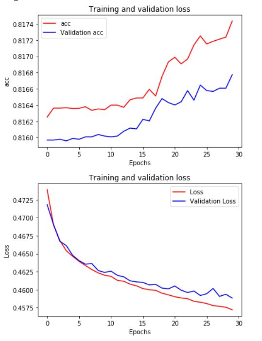
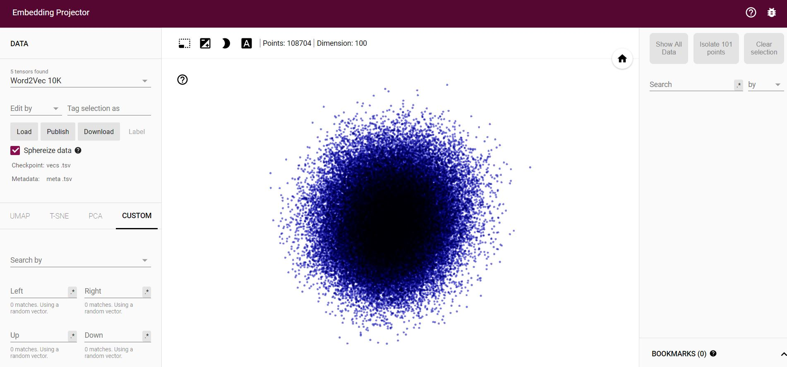
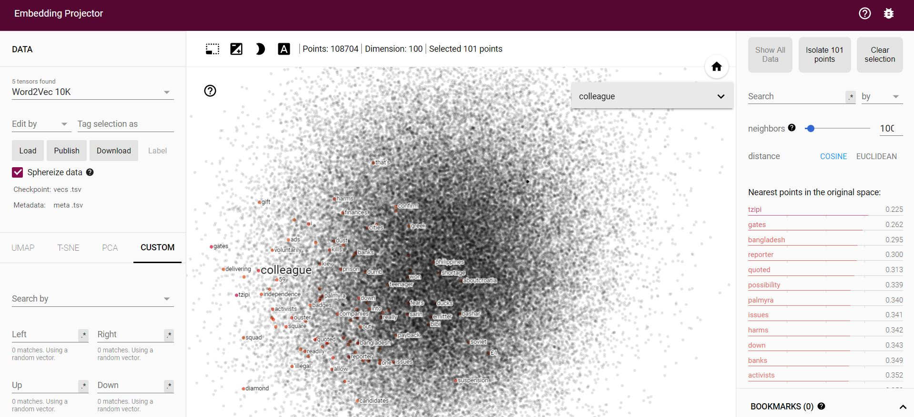

# project
This Dataset is mainly based on the newspaper article. The dataset contains the article title along with the article writer and it's number of upvotes or downvotes. It also contains the date and the time of the article creation. The category of the articles and whather the content is over 18 or not are also included in the dataset. The aim of this project to analysis this dataset with the data visualization tools (Tableau) and also to build a NLP model to detect if an article will be upvoted or not based on it's content. 

Tableau Data Analysis
The Tableau file is uploaded in this repository. There are multiple articles for a single author. First of all, we can have a view or idea regarding which authors have how many numbers of articles and how much upvotes they get for their articles in this dataset. Below a screenshot of tableau data analysis for these authors is given.

Here, we will have an idea regarding authors writing's quality and their content. Also, We can see that the size of these circles defines which authors have larger writings and the color represents the number of upvotes of their writing. For example, Doremus-Jessup has most writings although he does not have maximum upvotes. Whereas, Anutensi have most upvotes in his or her writings even though he or she is not one of the most written article holders over these years. From this, we can have an idea regarding it's content whenever we saw an article by a specific author for example i.e., We will know if it will probably get an upvote or downvote.

Secondly, we can see over the year how these article numbers and upvotes are changing.

Although the number of articles is increasing each year compared to the previous years. The total number of upvotes received in the year 2015 is slightly highest. Maybe there are some writings style or contents or certain authors wrote more in that period which was more enticing than other periods.

Now whether an article is over_18 can be analyzed also. In the following portrayal, this is shown.

Most of the articles are not over_18. Also, most upvotes articles are not over_18.

Now it's time to connect the dots between these three plots. For this, I created a dashboard that incorporates all of three plots. One dashboard story is given below.
  
   
  
  Where we can see in the year 2015 which authors wrote the article and among these articles how many got upvotes from which authors or how many are over_18 from which authors. Thus, through this dashboard, we can easily filter important information that we need. For example, in year 2015, most of the upvoted aritcle content authors wrote in this period. The total number of upvotes that's why high in this year compared to other years. 

  
  Also say, we want to analysis  Doremus-Jessup. He published articles for years 2011-2016. He published most in the year of 2015. His total upvotes are 277,001 where the total number of articles is 1744 and all of them are not over_18. In the year 2015, he published most articles compared to other years which are 47.5% of his total published article. Similarly, we can analyze the data from this created dashboard for each year or author, etc.

  
  
  

  # NLP problem
 
 If we inspect the data, we can create a text classification problem based on the article texts and whether an article gets upvotes or not. After reviewing the whole dataset, I came to conclusion that it would be much fit if we classified the upvotes into two groups. Groups '0' where the articles get zero upvotes, group '1', where the article gets at least 1 upvote. This is beacuse the number of votes can be indefinite and also sparse in categories. For this, I am using a Neural network, which is renowned for the NLP problem and also has a greater advantage of this kind of situation. I use the combination of Dense, Convolution and LSTM layers and create a validation dataset that consists of 20% of the data. The loss and accuracy of both the training set and test sets are given below. Where we can see that the model loss is in the right direction which is converging to zero and accuracy is converging to one. Both validation loss and accuracy gives the right direction results. Validation loss is acceptable with apprimately 82%. The following figure describes these values. The Whole architecture is built on Goggle Colab and it's given in this github repository('DataScience_coding_prob.ipynb'). 

   
   

  
 Now let's see the problem in embedding projector. The output of the embedding layer's weight is collected. Then we collected the embedding dimension for each word. If we paste the tsv file for vec and meta which are put in github repository(metadat.tsv, vec.tsv) into the tensorflow projector, we will get nearest neighbors for each word. 
  The embedding projector snapshot is given below:

     
   
     

Now let's see what are the 100 nearest words stick to 'colleague'. In the following picture, we will have these words. From this, we can guess the idea of an article category based on this nearest neighbor classifier. Thus if an article's words are neighbors to certain words
we can have a clear idea of what that article will be in terms of up_votes, down_votes, authors, etc. 

   
   
